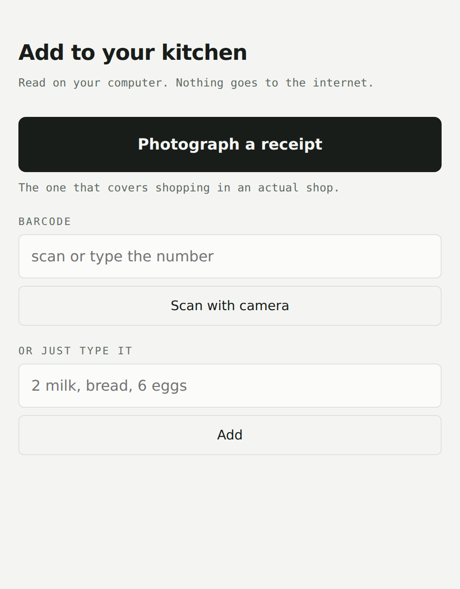

# HomeStock

**Never run out. Never throw food away.** HomeStock reads your shopping
receipts and keeps track of what's in your house — what you have, what you're
about to run out of, what to eat before it goes off. You never type anything in.

Your data never leaves your computer. It's one file, on your disk, that you own.


- [Why this one works when pantry apps don't](#why-this-one-works-when-pantry-apps-dont)
- [Install](#install) · [Connect it to your AI](#connect-it-to-your-ai) · [First run](#first-run)
- [Getting things in](#getting-things-in) · [Capturing from your phone](#capturing-from-your-phone)
- [Privacy](#privacy) · [What's not built yet](#whats-not-built-yet)
- [Tools, prompts and resources](#tools-prompts-and-resources) · [Contributing](#contributing)

## Why this one works when pantry apps don't

Every fridge-tracking app dies the same way: it treats your kitchen as facts
you have to keep correct, and keeping them correct is endless work.

HomeStock never asks you to inventory anything. It treats your kitchen as a
**probable estimate** derived from what you actually bought — "you buy milk
every 5 days, you bought some 6 days ago, you're probably out" — and shows its
reasoning on every line, so you can tell at a glance whether to trust it. When
it's wrong, one click fixes it, and the correction outranks the guess.

The insight the whole thing rests on: **you never tell anyone how much milk you
drink, but how often you rebuy it says exactly that.**

## Install

**You need:** a Mac or Linux machine, Python 3.11 or newer, and a terminal.
Windows isn't supported yet ([why](TODOS.md)).

The easy way is with [uv](https://docs.astral.sh/uv/), a fast Python installer.
If you don't have it:

```bash
curl -LsSf https://astral.sh/uv/install.sh | sh
```

Then:

```bash
git clone https://github.com/Thomaspeel6/HomeStock && cd HomeStock
uv run pytest -q          # 81 tests — confirms it works on your machine
uv run homestock-ui       # opens your kitchen at http://127.0.0.1:7777
```

<details>
<summary>Without uv, using pip</summary>

```bash
git clone https://github.com/Thomaspeel6/HomeStock && cd HomeStock
python3 -m venv .venv && source .venv/bin/activate
pip install -e .
homestock-ui             # the pantry window
homestock                # the MCP server (stdio)
```

</details>

Your database is `./homestock.db`, or wherever you point `$HOMESTOCK_DB`.
Photographed receipts go in a `captures/` folder beside it. Both are yours —
copy them to back up, delete them to erase everything.

### See it working before you commit to anything

```bash
uv run python scripts/demo.py --serve
```

That invents a household with six months of shopping and opens the window on
it, so you can see what a full kitchen looks like. It touches no email, and
throws the demo database away afterwards.

## Connect it to your AI

HomeStock is also an MCP server, so an AI client can read and write the same
file: *"what can I make for dinner with what I've got?"* *"here's a receipt."*
*"we're out of milk."* This is where the ceiling is much higher than any UI.

**Claude Code** — nothing to do. `.mcp.json` in this repo registers it when you
run Claude Code from this directory.

**Claude Desktop** — add this to `claude_desktop_config.json`
(on macOS: `~/Library/Application Support/Claude/`), then restart it:

```json
{
  "mcpServers": {
    "homestock": {
      "command": "uv",
      "args": ["run", "--directory", "/absolute/path/to/HomeStock", "homestock"]
    }
  }
}
```

**Anything else that speaks MCP** — point it at `uv run homestock` (or just
`homestock` if you installed with pip), talking stdio.

Connect it and the server hands over everything needed to run ingestion: the
`onboarding` and `ingestion` prompts, and the retailer recipes as resources.
No filesystem access required.

## First run

Ask your agent to follow the `onboarding` prompt. It will:

1. Tell you exactly what it's about to look at, and wait for a clear yes.
   Declining is fine — the manual paths all still work.
2. Read up to six months of receipt emails from retailers you approve,
   read-only.
3. Show you your kitchen, plus a few true things about your own shopping you
   probably didn't know.

If you'd rather not connect email at all, skip to
[Getting things in](#getting-things-in) — photographing receipts and typing
work on their own.

## Getting things in

Receipt emails only ever see online and delivery orders. Buy milk in a corner
shop and a system watching only your inbox will confidently tell you to buy
more — so there are four doors, not one:

| | How |
|---|---|
| **Receipt emails** | Read-only, sender-filtered, from shops you approve. |
| **Photograph a paper receipt** | Point your phone at it. Covers shopping in an actual shop. |
| **Scan a barcode** | Phone camera, or type the number. |
| **Just type it** | "2 milk, bread, 6 eggs" — always available, works offline. |

Everything lands in an **inbox** rather than going straight into your kitchen.
Capturing has to work instantly, one-handed, in a shop; reading needs a model.
Keeping them apart is what lets a phone contribute to a database it can't
reason about — and means an unreadable photo gets honestly skipped instead of
guessed at.

## Capturing from your phone

```bash
uv run homestock-ui --lan
```

Your laptop prints a six-digit code and an address. On your phone, on the same
wifi, open the address and enter the code. Photos go straight to your laptop
and never touch the internet.



LAN mode is **off by default and stays off unless you ask for it** — binding to
the network on a café wifi would hand a stranger your shopping history. While
it's on, nothing is readable until a device has paired, codes expire after ten
minutes, and five wrong guesses burn the code. It is plain HTTP, so don't use
it on shared or workplace networks; see [SECURITY.md](SECURITY.md) for the
full threat model, stated plainly.

## Cooking

```
"can I make carbonara?"     -> check_recipe([...])   what you have, what's missing
"made it, used the butter"  -> consume_items([...])  deducts, and puts butter on the list
```

Cooking is the biggest real depletion event in a kitchen, and until now nothing
modelled it — stock only ever drained by inference. Your agent turns a recipe
(pasted, a link, a photo of a cookbook page) into an ingredient list; HomeStock
does the set maths against what you actually have, because that's the part that
has to be exactly right.

## Privacy

- **What HomeStock can see:** receipt emails from shops you approve — read-only,
  sender-filtered. Nothing else, ever.
- **Where your data lives:** `homestock.db` and `captures/` on your computer.
- **What leaves your machine: nothing.** No telemetry, no accounts, no cloud,
  no webfonts, no CDN assets. The server and the window make no outbound
  requests at all.
- **When something's wrong:** `get_health()` reports counts and dates only —
  never item names, never email content — so it's safe to paste into an issue.

This isn't a policy promise. There is no server to send anything to. The one
place your data does travel is your AI client: when an agent reads your stock
to answer a question, that conversation goes wherever that client sends it,
under its own privacy policy. HomeStock can't change that and doesn't pretend
to.

## What's not built yet

Being straight with you, because the gap between the idea and the code is
where open-source projects usually mislead people:

- **No double-click app.** A macOS `.app` is specified in
  [PRD-HomeStock-v3.md](PRD-HomeStock-v3.md) but not built. Today this needs a
  terminal.
- **Email ingestion is agent-driven, not built-in.** There's no OAuth flow yet;
  an agent reads your mail by following the `ingestion` prompt. Built-in
  fetching is the next big piece.
- **Not on PyPI yet**, so installation means cloning.
- **The Amazon recipe is unverified.** Amazon appears to have stripped itemised
  details from most confirmation emails around 2023. If that holds, Amazon
  coverage is close to zero and this is a Tesco-only tool for now. If you have
  Amazon GB receipts, [telling us what's in them](../../issues/new?template=retailer.yml)
  is genuinely the most useful thing you could do.
- **Windows, multi-home sync, and a recipe suggester** are all deliberately out
  of scope for now. See [TODOS.md](TODOS.md) for what's deferred and why.

Status: **alpha**, macOS-first, built for the author's own household first. If
it isn't useful to one person for a month, nothing else matters.

## Tools, prompts and resources

For agents, and for anyone reading the code. Nineteen tools over an append-only
event log — every estimate is recomputable from `get_events()`.

Four input paths mean four names for the same milk: a barcode says
`Tesco British Semi Skimmed Milk 2.27L`, a receipt line says `TESCO SEMI SKMD
MILK`, you say `milk`. Aliases are where the model's answer to that gets
remembered, so the same string never has to be resolved twice — and so those
don't become three items with three wrong repurchase cycles.

| Tool | Purpose |
|---|---|
| `add_items(items[], source, source_ref, purchased_at?, location?)` | Record a purchase from any door: `email`, `photo`, `barcode`, `loyalty`, `manual`. Idempotent per `(source_ref, line_no)`. |
| `get_stock(item?)` | No arg: known items. With arg: estimate, confidence, and raw provenance. |
| `what_should_i_order()` | The shopping list: items past their usual cycle, plus anything you said you were out of. |
| `get_expiring_soon(within_days)` | Perishables at or near their use-by. |
| `correct_stock(item, quantity, unit?)` | Ground truth. `0` means "we're out". Outranks the estimate and resets its clock. |
| `discard_item(item, quantity?, unit?)` | Record waste — and the signal that a shelf-life estimate was too generous. |
| `set_shelf_life(item, days, storage?)` | How long something keeps, so it can be flagged before it rots. |
| `check_recipe(ingredients[])` | Can I cook this? Sorts ingredients into have / low / missing. |
| `consume_items(items[])` | Record cooking. `finished: true` for anything you used the last of. |
| `add_capture(kind, text?, path?, device?)` | Put a photo, barcode or note in the inbox to be read later. |
| `list_captures(status?)` / `resolve_capture(id, status?, note?)` | Work the inbox. Never guess at a blurry receipt — skip it with a reason. |
| `add_alias(alias, item)` / `list_aliases(item?)` | Teach it that "TESCO SEMI SKMD MILK" is the milk it already knows. |
| `merge_items(from_item, into_item)` | Fix name drift without losing history — and learns the alias, so it can't recur. |
| `void_event(source_ref, line_no?)` | Fix a *receipt*: void, then re-insert the corrected line. |
| `get_events(item?, since?, limit?, offset?)` | Raw event log, paged — every estimate is explainable. |
| `record_ingest_run(...)` | Ingestion heartbeat + backfill cursor. |
| `get_health()` | Diagnostics. Is ingestion actually running? |

**Prompts:** `onboarding` (consent, backfill, the reveal) and `ingestion` (the
scheduled procedure, and the rules that stop it guessing).

**Resources:** `homestock://recipes` lists the retailers it can read;
`homestock://recipes/{retailer}` returns one.

## Contributing

The most useful contribution is a **retailer recipe** — coverage for a shop we
can't read yet. A recipe is a small YAML file describing which email carries the
real line items. **Data, never code. No parsers.**

Start at [CONTRIBUTING.md](CONTRIBUTING.md), or just
[open an issue with a redacted sample](../../issues/new?template=retailer.yml)
and someone else can write the recipe.

This corpus — a map of which email from which retailer tells the truth — is the
part that compounds, and no one else is building it.

## Project docs

| | |
|---|---|
| [PRD-HomeStock-v3.md](PRD-HomeStock-v3.md) | What it is and where it's going |
| [PRD-HomeStock-v2.md](PRD-HomeStock-v2.md) | The engine's design rationale |
| [TODOS.md](TODOS.md) | Deferred work, with the reasoning |
| [CHANGELOG.md](CHANGELOG.md) | What changed, and when |
| [SECURITY.md](SECURITY.md) | Threat model and how to report a problem |
| [CONTRIBUTING.md](CONTRIBUTING.md) | Dev setup and house rules |

Source-available under the [Functional Source License](LICENSE) (FSL-1.1-MIT).

Read it, run it, change it, self-host it, contribute to it — all fine. The one
thing you may not do is ship a commercial product that competes with it. Two
years after each release, that release becomes plain MIT automatically, so
nothing here is locked away forever.
