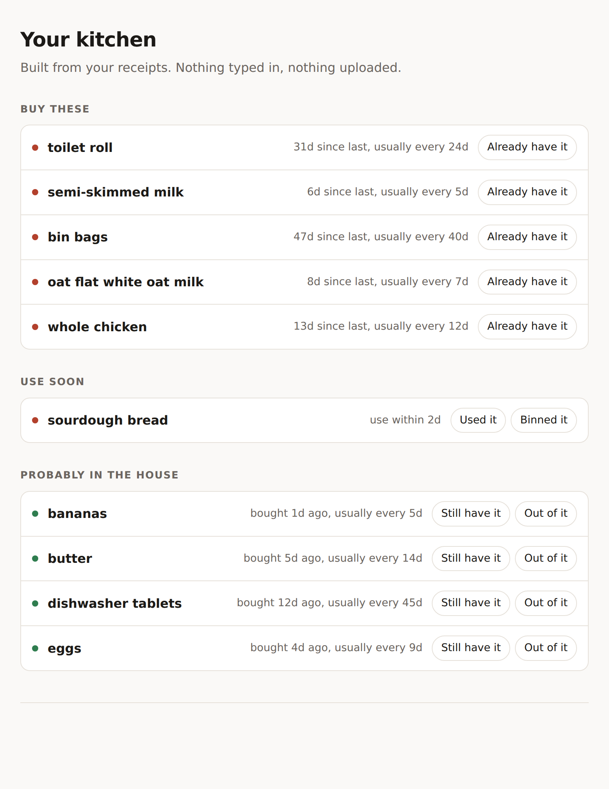

# HomeStock

**Never run out. Never throw food away.** HomeStock reads your shopping receipt
emails and keeps track of what's in your house — what you have, what you're
about to run out of, what to eat before it goes off. You never type anything in.

Your data never leaves your computer. It's one file, on your disk, that you own.



## Why this one works when pantry apps don't

Every fridge-tracking app dies the same way: it treats your kitchen as facts you
have to keep correct, and keeping them correct is endless work.

HomeStock never asks you to inventory anything. It treats your kitchen as a
**probable estimate** derived from what you actually bought — "you buy milk
every 5 days, you bought some 6 days ago, you're probably out" — and shows its
reasoning on every line, so you can tell at a glance whether to trust it. When
it's wrong, one tap fixes it, and it learns the correction.

The insight the whole thing rests on: **you never tell anyone how much milk you
drink, but how often you rebuy it says exactly that.**

## Two ways to use it

**As an app.** A window showing your kitchen. Three lists — buy these, use soon,
probably in the house — and a button when something's wrong.

**As an AI tool.** HomeStock is also an MCP server, so Claude (or any MCP
client) can read and write the same file: *"what can I make for dinner tonight?"*
*"add this receipt."* *"we're out of milk."*

Same database, either way. Use one or both.

## Try it in thirty seconds

```bash
git clone https://github.com/Thomaspeel6/HomeStock && cd HomeStock
uv run python scripts/demo.py --serve
```

That seeds a fictional household with six months of shopping and opens the
window on it. Nothing touches your email, and the demo database is thrown away.

To run it for real:

```bash
uv run pytest -q            # 31 tests
uv run homestock-ui         # the pantry window   -> http://127.0.0.1:7777
uv run homestock            # the MCP server (stdio)
```

The database is `./homestock.db`, or wherever `$HOMESTOCK_DB` points.
`.mcp.json` registers the server for Claude Code in this directory; for other
MCP clients, point them at `uv run homestock`.

Then, in your agent: follow [`prompts/onboarding.md`](prompts/onboarding.md) —
consent, backfill your receipt history, get your pantry reveal. Scheduled
ingestion uses [`prompts/ingestion.md`](prompts/ingestion.md).

> **Status: alpha, and honest about it.** macOS-first, built for the author's
> own household. The double-click `.app` described in
> [`PRD-HomeStock-v3.md`](PRD-HomeStock-v3.md) is not built yet — today it still
> takes a terminal. If it isn't useful to one person for a month, nothing else
> matters.

## Your privacy, in plain English

- **What HomeStock can see:** receipt emails from shops you approve — read-only,
  sender-filtered. Nothing else, ever.
- **Where your data lives:** one file, `homestock.db`, on your computer. Copy it
  to back it up. Delete it to erase everything. That's the whole model.
- **What leaves your machine: nothing.** No telemetry, no accounts, no cloud.
  The server makes no network calls. (Your AI client processes your
  conversations under its own privacy policy, exactly as it already does.)
- **When something's wrong:** `get_health()` reports counts and dates only —
  never item names, never email content — so it's safe to paste into a bug
  report.

This isn't a policy promise. There is no server to send anything to.

## Tools

For agents, and for anyone reading the code. Twelve tools over an append-only
event log — every estimate is recomputable from `get_events()`.

| Tool | Purpose |
|---|---|
| `add_items(items[], source, source_ref, purchased_at?, location?)` | Record a receipt. Idempotent per `(source_ref, line_no)` — re-ingestion can never double-count. |
| `get_stock(item?)` | No arg: known items. With arg: estimate, confidence, and raw provenance. |
| `what_should_i_order()` | The shopping list: items past their usual cycle, plus anything you said you were out of. |
| `get_expiring_soon(within_days)` | Perishables at or near their use-by. |
| `correct_stock(item, quantity, unit?)` | Ground truth. `0` means "we're out". Outranks the estimate and resets its clock. |
| `discard_item(item, quantity?, unit?)` | Record waste — and the signal that a shelf-life estimate was too generous. |
| `set_shelf_life(item, days, storage?)` | How long something keeps, so it can be flagged before it rots. |
| `merge_items(from_item, into_item)` | Fix name drift ("milk" vs "semi-skimmed milk") without losing history. |
| `void_event(source_ref, line_no?)` | Fix a *receipt*: void, then re-insert the corrected line. |
| `get_events(item?, since?)` | Raw event log — every estimate is explainable. |
| `record_ingest_run(...)` | Ingestion heartbeat + backfill cursor. |
| `get_health()` | Diagnostics. Is ingestion actually running? |

## Retailer recipes (community)

The ingestion agent learns retailers from [`recipes/`](recipes/) — small YAML
files describing which email carries the real line items and how to read them.
**Data, never code. No parsers.** If your shop isn't covered, copy
[`recipes/TEMPLATE.md`](recipes/TEMPLATE.md) and open a PR — see
[CONTRIBUTING.md](CONTRIBUTING.md). Launch recipes: Tesco (GB), Amazon (GB).

This corpus — a map of which email from which retailer tells the truth — is the
part that compounds, and the most useful thing you can contribute.

## Project docs

- What it is and where it's going: [`PRD-HomeStock-v3.md`](PRD-HomeStock-v3.md)
- The engine's design rationale: [`PRD-HomeStock-v2.md`](PRD-HomeStock-v2.md)
- Deferred work: [`TODOS.md`](TODOS.md)
